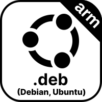

[English](./README.md) | [日本語](./README.ja.md) | [简体中文](./README.zh-CN.md) | [繁體中文](./README.zh-TW.md) | [한국어](./README.ko.md)

# From Earth

美しい地球を探索しよう！

## 機能

- 数千の美しい場所を探索
- 壁紙として設定
- お気に入りに追加

など！

## ダウンロード

### Mac

### Windows

### Linux

    

    

###

利用可能な全てのダウンロードは、[リリース](https://github.com/owfdr/from-earth/releases/latest)ページをご参照ください。

## スクリーンショット

Windows (英語版)

Ubuntu (英語版)

