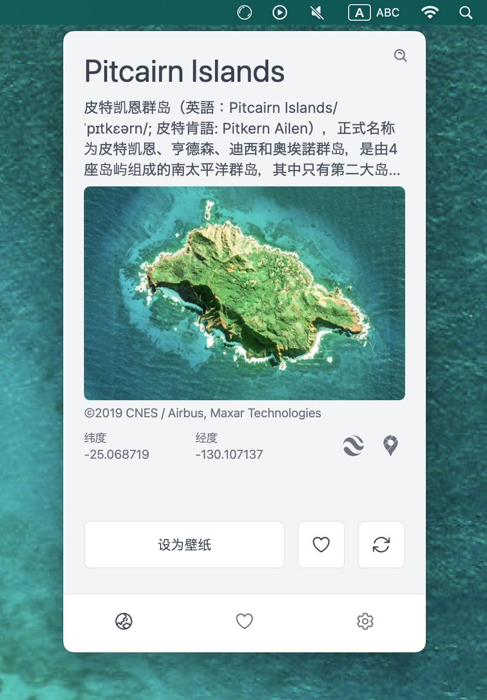

[English](./README.md) | [日本語](./README.ja.md) | [简体中文](./README.zh-CN.md) | [繁體中文](./README.zh-TW.md) | [한국어](./README.ko.md)

# From Earth

让我们探索地球上的美丽之地。

## 特性

- 探索数千个美丽的地方
- 设为您的壁纸
- 加入到您的收藏夹

还有更多！

## 下载

### Mac

### Windows

### Linux

    

    

###

有关于所有可用的下载，请参考[发布](https://github.com/owfdr/from-earth/releases/latest)页面。

## 截图

在 Windows

在 Ubuntu (Linux)

在 MacOS (深色模式)

## 🧑‍💻 其他应用

请查看:

- [Our World](https://ourworld.center/zh/apps) (官方网站)
